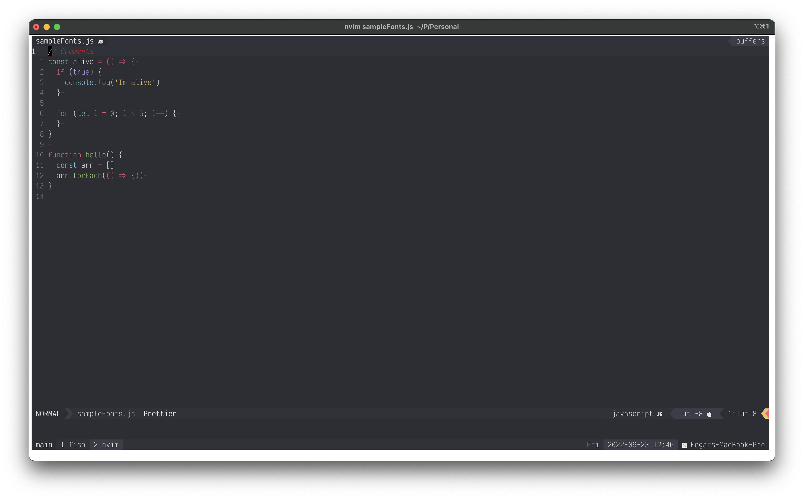
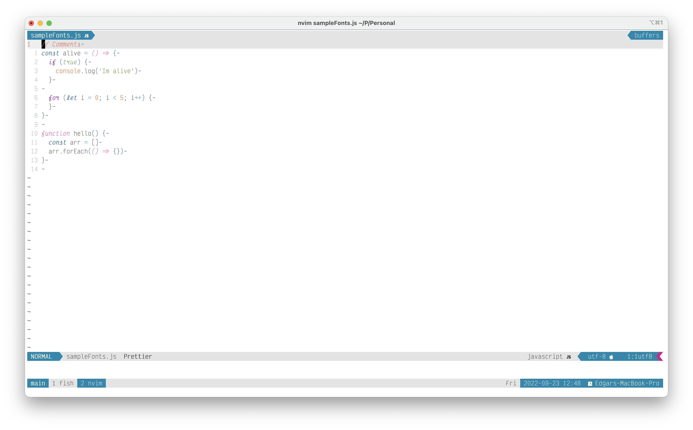

# Setting up development enviroment

## Description

This repository contains a set of configurations to install a development environment intended for osx systems and designed to use [Vim(8) plugins with the native pack system](https://medium.com/@paulodiovani/installing-vim-8-plugins-with-the-native-pack-system-39b71c351fea).


#### Tools
* [Fish shell](https://fishshell.com)
* [Fisher](https://github.com/jorgebucaran/fisher)
* [Hombrew](https://brew.sh)
* [Tmux](https://github.com/tmux/tmux/wiki)
* [Vim plugins 8]((https://medium.com/@paulodiovani/installing-vim-8-plugins-with-the-native-pack-system-39b71c351fea)

### Installing
In the repository there is a Makefile file, this will be in charge of executing all the configurations of each tool. (*_Remember that this configuration is designed to run on mac os systems_*).
```sh
  $ make
```


## Hombrew
`brew.sh` file install homebrew if isnt installed and install some utiliies and cask.
 
*Some Homebrew formulas*
* GIT
* Nodejs
* [Neovim](https://neovim.io)
* [Tmux](https://github.com/tmux/tmux/wiki)
* [GH github cli](https://cli.github.com)
* [Fish shell](https://fishshell.com)
* *homebrew/cask-fonts*
  * [font-firaCode-nerd-fon](https://github.com/ryanoasis/nerd-fonts#font-installation)
  * [Victor Mono](https://rubjo.github.io/victor-mono/)
* *caskroom/cask*
  * [Docker](https://www.docker.com)
  * [insomnia](https://www.postman.com/product/api-client/)
  * [Iterm2](https://iterm2.com)
  
## Fish
Set a fish shell as a default shell and install *[fisher](https://github.com/jorgebucaran/fisher)* to handle `nvm`
and set a vim as default editor

## TMUX
Change a key bind action to `<C-t>` and also has an integration with N/vim. It also includes some utilities to be able to change the themes of tmux and vim between dark and light mode

## Vim
Download repository wich has a some vimrc configs and a some plugins 
* to see wich plugins and configuration has it, take a look [EddCode/vimrc](https://github.com/EddCode/vimrc)




>If you want to iterm support italic font run command below.

```
  $ tic -x xterm-256color-italic.terminfo
  $ tic -x tmux-256color.terminfo
```


<pre>
  In this repo there a python script that helps switching 
  iterm2 background color base on the system. 
  ou can import <a href='https://github.com/EddCode/dotfiles/blob/main/auto_change_background.py'>auto_change_background.py</a> script to iterm to automatic switching 
  background colors.
  <a href='https://iterm2.com/python-api/tutorial/running.html'>Check how you can do it.</a>

  Be free to modify the colors into the script. 
  Actualy its used <a href='https://raw.githubusercontent.com/mbadolato/iTerm2-Color-Schemes/master/schemes/Batman.itermcolors'>Batman</a> and <a href='https://raw.githubusercontent.com/mbadolato/iTerm2-Color-Schemes/master/schemes/Alabaster.itermcolors'>alabaster</a>.

  You can take a look to more color themes <a href='https://iterm2colorschemes.com'>here</a>.
<pre>
